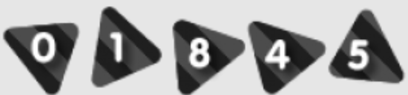

<h1 align="center">
  
</h1>

---

# Custom GitHub visitor counter

## Summary

- Developers should always refer to the README file before beginning any project. This file contains essential information that should be compiled concisely and accurately. Therefore, it's crucial for developers to know how to create a well-written README file that includes all the relevant details necessary to get started. In this project, you will find a way to stand out from other README files with a customizable counter of your choice !

## Objectives

- Customize your GitHub visitor counter.

## Technology

- Node.js

## UI

## Authors

- [@Jason](https://github.com/JasonDhose)
- [@Pierre](https://github.com/Pierre-Portfolio)